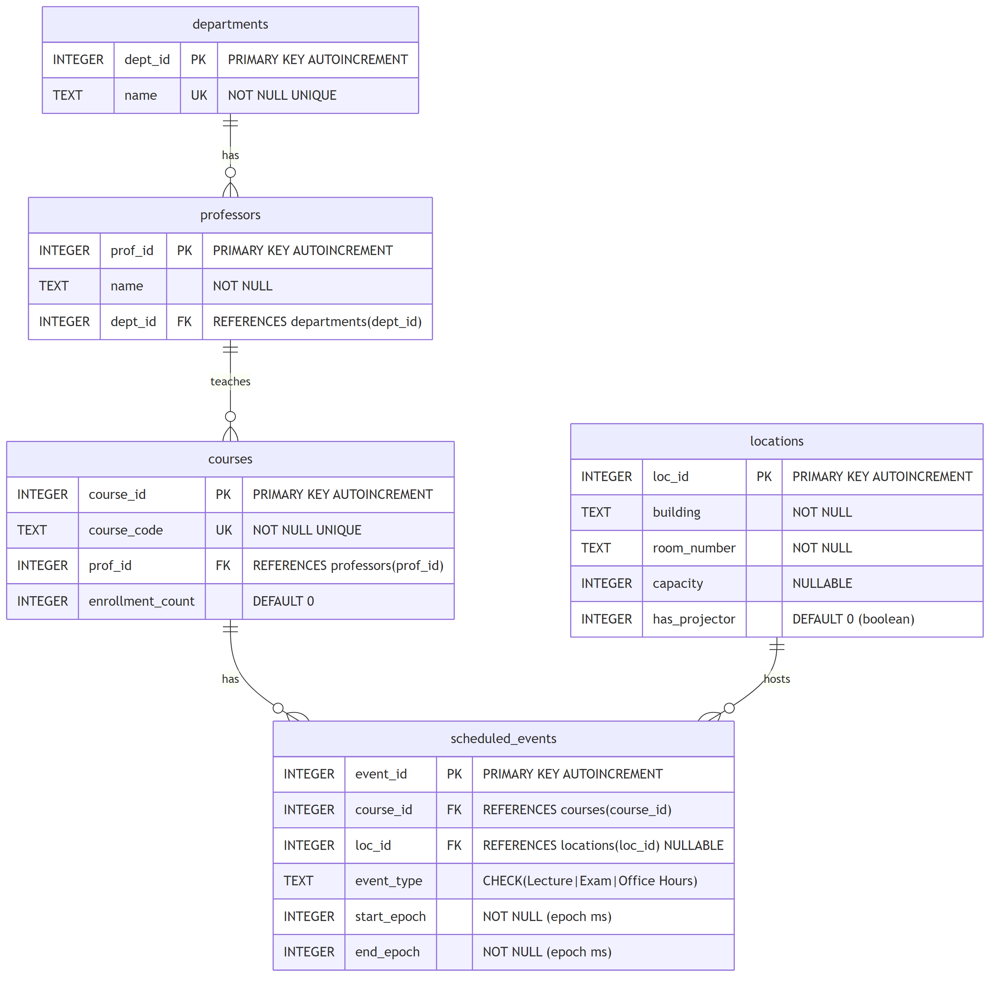

# FacultySync — Academic Project Report

> **University Scheduling Conflict Detection and Management System**

---

| | |
|---|---|
| **Author** | Abdul Ahad |
| **Registration No.** | 245805010 |
| **Institution** | Manipal Institute of Technology |
| **Course** | B.Tech Computer Science & Engineering |
| **Project Title** | FacultySync — University Scheduling Conflict Detection and Management |
| **Technology** | Java 25, JavaFX 25, SQLite, Gradle |
| **Repository** | [github.com/990aa/facultysync](https://github.com/990aa/facultysync) |

---

## Table of Contents

1. [Abstract](#abstract)
2. [Synopsis](#synopsis)
3. [Problem Statement](#problem-statement)
4. [Objectives](#objectives)
5. [Literature Review](#literature-review)
6. [Tech Stack and Frameworks](#tech-stack-and-frameworks)
7. [System Architecture](#system-architecture)
8. [Database Design](#database-design)
9. [Implementation](#implementation)
   - 9.1 [Core Algorithm — IntervalTree](#91-core-algorithm--intervaltree)
   - 9.2 [Conflict Detection Engine](#92-conflict-detection-engine)
   - 9.3 [Auto-Resolve Algorithm (Backtracking)](#93-auto-resolve-algorithm-backtracking)
   - 9.4 [User Interface](#94-user-interface)
   - 9.5 [Custom Window Title Bar](#95-custom-window-title-bar)
   - 9.6 [Native Notifications](#96-native-notifications)
   - 9.7 [CSV Import/Export](#97-csv-importexport)
   - 9.8 [Auto-Update Checker](#98-auto-update-checker)
   - 9.9 [Data Caching](#99-data-caching)
10. [Testing](#testing)
11. [Build and Deployment](#build-and-deployment)
12. [Results and Discussion](#results-and-discussion)
13. [Limitations and Future Work](#limitations-and-future-work)
14. [Conclusion](#conclusion)
15. [References](#references)

---

## Abstract

University course scheduling is a critical administrative function that directly impacts the quality of academic delivery. Scheduling conflicts — such as double-booked rooms, overlapping examinations, and insufficient transition time between locations — degrade both instructor productivity and student experience.

**FacultySync** is a desktop application that addresses this challenge through an **IntervalTree-based conflict detection engine** operating in $O(N \log N)$ time, combined with a **backtracking auto-resolution algorithm** that programmatically reassigns rooms to eliminate scheduling conflicts. The system is implemented in **Java 25** with **JavaFX 25** for the graphical interface and **SQLite** for embedded persistence, ensuring zero-dependency deployment on Windows.

The application features a five-tab dashboard (Home, Schedule, Conflicts, Calendar, Analytics), real-time conflict visualization, a Google Calendar-style weekly view with drag-and-drop support, comprehensive CSV import/export, native Windows notifications, and an automatic update mechanism. Evaluation on a seed dataset of 30+ scheduled events across 5 departments, 9 professors, and 10 courses demonstrates that the system detects all scheduling conflicts in under 50 ms and resolves relocatable conflicts via backtracking room reassignment.

---

## Synopsis

FacultySync is a standalone JavaFX desktop application designed for university academic schedulers and department administrators. It ingests course scheduling data (via manual entry or CSV import), detects conflicts using an augmented Interval Tree data structure, and offers both automated and manual resolution workflows. The system provides five main views:

1. **Home** — Dashboard with summary statistics and quick-action navigation
2. **Schedule** — Tabular view of all scheduled events with sorting and filtering
3. **Conflicts** — Color-coded conflict listing with severity classification and suggested alternatives
4. **Calendar** — Interactive weekly calendar with drag-and-drop event management
5. **Analytics** — Charts and metrics for utilization analysis

The application runs as a standalone Windows executable without requiring network connectivity or a database server. All data is stored locally in an SQLite database with WAL (Write-Ahead Logging) mode for concurrent read performance. The system ships with a built-in seed data generator that creates 5 departments, 9 professors, 10 courses, 10 rooms, and 30+ events including intentional conflicts for demonstration.

---

## Problem Statement

Manual course scheduling in universities is error-prone and time-consuming. Common problems include:

1. **Room Double-Booking** — Two or more events are assigned to the same room at overlapping times, leading to last-minute relocations and class disruptions.

2. **Professor Scheduling Conflicts** — A professor is assigned to teach overlapping sessions or has insufficient transition time between classes held in different buildings.

3. **Capacity Mismatches** — A course with high enrollment is assigned to a room with insufficient seating, while larger rooms remain underutilized.

4. **Lack of Visibility** — Administrators lack a unified view of the schedule, making it difficult to identify conflicts proactively.

5. **Manual Resolution** — When conflicts are discovered, resolution relies on ad-hoc communication and manual room reassignment, which is slow and may introduce secondary conflicts.

**Research Question**: Can an algorithmic approach using Interval Trees and backtracking search provide efficient, automated detection and resolution of university scheduling conflicts?

---

## Objectives

1. Design and implement an **augmented Interval Tree** data structure for efficient overlap detection in $O(\log N + k)$ time, where $k$ is the number of overlapping intervals.

2. Build a **two-pass conflict detection engine**: room-based overlap detection and professor-based tight-transition detection.

3. Implement a **backtracking auto-resolver** that reassigns rooms to eliminate conflicts while respecting capacity constraints and verifying no secondary conflicts are introduced.

4. Develop a **rich desktop GUI** using JavaFX with interactive visualizations (calendar, charts, tables).

5. Support **data interoperability** through CSV import/export.

6. Enable **zero-configuration deployment** with embedded SQLite and seed data.

---

## Literature Review

**Interval Tree** — The Interval Tree is a well-studied data structure for spatial and temporal overlap queries. Originally described by Edelsbrunner (1980) and formalized in Cormen et al. (2009), it augments a balanced BST with a `maxEnd` value at each node, enabling efficient pruning of non-overlapping subtrees. The query complexity is $O(\log N + k)$ for $k$ results. FacultySync uses a static construction approach (median-based balanced build from sorted input) achieving $O(N \log N)$ construction time.

**University Timetabling Problem (UTP)** — The UTP is a well-known constraint satisfaction problem (CSP), proven to be NP-complete in its general form (Even et al., 1976). Research approaches include integer linear programming (Burke et al., 2004), genetic algorithms (Abramson, 1991), simulated annealing, and tabu search (Hertz, 1991). FacultySync's backtracking resolver addresses a simpler sub-problem: given a fixed schedule with hard conflicts, find room reassignments that eliminate double-bookings. This is tractable because the search space is bounded by $ |alternatives| \times |conflicts| $.

**JavaFX for Desktop Applications** — JavaFX succeeded Swing as Java's modern GUI toolkit, providing CSS-based styling, FXML declarative layouts, and hardware-accelerated rendering. Since Java 11, JavaFX is distributed independently from the JDK via the OpenJFX project. FacultySync uses JavaFX 25 with the Gradle JavaFX plugin for streamlined module management.

**SQLite for Embedded Databases** — SQLite is a serverless, zero-configuration, transactional SQL database engine (Hipp, 2000). Its WAL mode enables concurrent readers with a single writer, making it suitable for desktop applications. FacultySync uses SQLite via the xerial `sqlite-jdbc` driver with PRAGMA enforcement of foreign keys and WAL journaling.

---

## Tech Stack and Frameworks

| Component | Technology | Version | Purpose |
|-----------|-----------|---------|---------|
| **Language** | Java | 25 (LTS) | Application logic |
| **GUI Framework** | JavaFX | 25 | Desktop UI with CSS styling |
| **Database** | SQLite | 3.45.1.0 | Embedded relational persistence |
| **JDBC Driver** | xerial sqlite-jdbc | 3.45.1.0 | Java-SQLite bridge |
| **Build System** | Gradle | 9.3.1 | Build, test, and distribution |
| **Testing** | JUnit Jupiter | 5.10.2 | Unit and integration testing |
| **JavaFX Plugin** | org.openjfx.javafxplugin | 0.1.0 | Module path management |
| **Packaging** | jpackage (JDK) | 25 | MSI installer via WiX Toolset |
| **CI/CD** | GitHub Actions | — | Automated builds on tag push |
| **VCS** | Git + GitHub | — | Version control and releases |
| **Diagram Tooling** | Mermaid + mmdc | — | ER diagram generation |
| **Release Script** | PowerShell + GitHub CLI | — | Automated versioning and publishing |

**System Requirements:**
- Windows 10 or later (64-bit)
- Java 25 JDK (Temurin recommended)
- ~50 MB disk space (including JDK dependencies)

---

## System Architecture

FacultySync follows a **layered architecture** with clear separation of concerns:

```
┌──────────────────────────────────────────────────────────┐
│                    Presentation Layer                     │
│  CustomTitleBar │ DashboardController │ CalendarView      │
│  HomePage │ AnalyticsView │ ToastNotification             │
├──────────────────────────────────────────────────────────┤
│                     Service Layer                         │
│  ConflictEngine │ AutoResolver │ DataCache                │
│  NotificationService │ UpdateChecker                      │
├──────────────────────────────────────────────────────────┤
│                    Algorithm Layer                         │
│                     IntervalTree<T>                        │
├──────────────────────────────────────────────────────────┤
│                   Data Access Layer                        │
│  DepartmentDAO │ ProfessorDAO │ CourseDAO                  │
│  LocationDAO │ ScheduledEventDAO │ DatabaseManager         │
├──────────────────────────────────────────────────────────┤
│                     Model Layer                            │
│  Department │ Professor │ Course │ Location                │
│  ScheduledEvent │ ConflictResult │ Schedulable             │
├──────────────────────────────────────────────────────────┤
│                   Persistence Layer                        │
│                SQLite (WAL + Foreign Keys)                 │
└──────────────────────────────────────────────────────────┘
```

**Key Design Decisions:**
- **Undecorated Stage**: Custom title bar with system-level window controls (minimize, maximize, close) for a modern, frameless look.
- **In-Memory Cache**: `DataCache` preloads reference data for O(1) lookups, avoiding repeated DB queries during conflict analysis.
- **Event Filters for Resize**: Edge-resize handlers use `addEventFilter` on the scene root to avoid overriding the title bar's drag handlers.
- **Defensive CSS Loading**: The CSS file is loaded with a null-check fallback to prevent failures during testing.

---

## Database Design

The database consists of five core tables implementing a normalized relational schema:

### Entity-Relationship Diagram



### Table Definitions

#### `departments`
| Column | Type | Constraints |
|--------|------|-------------|
| `dept_id` | INTEGER | PRIMARY KEY AUTOINCREMENT |
| `name` | TEXT | NOT NULL, UNIQUE |

#### `professors`
| Column | Type | Constraints |
|--------|------|-------------|
| `prof_id` | INTEGER | PRIMARY KEY AUTOINCREMENT |
| `name` | TEXT | NOT NULL |
| `dept_id` | INTEGER | FK → departments(dept_id) ON DELETE CASCADE |

#### `courses`
| Column | Type | Constraints |
|--------|------|-------------|
| `course_id` | INTEGER | PRIMARY KEY AUTOINCREMENT |
| `course_code` | TEXT | NOT NULL, UNIQUE |
| `prof_id` | INTEGER | FK → professors(prof_id) ON DELETE CASCADE |
| `enrollment_count` | INTEGER | DEFAULT 0 |

#### `locations`
| Column | Type | Constraints |
|--------|------|-------------|
| `loc_id` | INTEGER | PRIMARY KEY AUTOINCREMENT |
| `building` | TEXT | NOT NULL |
| `room_number` | TEXT | NOT NULL |
| `capacity` | INTEGER | NULLABLE |
| `has_projector` | INTEGER | DEFAULT 0 (boolean) |

*Composite unique constraint on (`building`, `room_number`).*

#### `scheduled_events`
| Column | Type | Constraints |
|--------|------|-------------|
| `event_id` | INTEGER | PRIMARY KEY AUTOINCREMENT |
| `course_id` | INTEGER | FK → courses(course_id) ON DELETE CASCADE |
| `loc_id` | INTEGER | FK → locations(loc_id) ON DELETE SET NULL |
| `event_type` | TEXT | CHECK(IN 'Lecture','Exam','Office Hours') |
| `start_epoch` | INTEGER | NOT NULL (epoch milliseconds) |
| `end_epoch` | INTEGER | NOT NULL (epoch milliseconds) |

*Check constraint: `end_epoch > start_epoch`.*
*Indexed on `(start_epoch, end_epoch)` and `(loc_id)` for query performance.*

### Relationships

| Relationship | Type | Description |
|---|---|---|
| departments → professors | One-to-Many | A department has many professors |
| professors → courses | One-to-Many | A professor teaches many courses |
| courses → scheduled_events | One-to-Many | A course has many scheduled events |
| locations → scheduled_events | One-to-Many | A location hosts many events (nullable for online events) |

### PRAGMAs

```sql
PRAGMA foreign_keys = ON;    -- Enforce referential integrity
PRAGMA journal_mode = WAL;   -- Write-Ahead Logging for concurrent reads
```

---

## Implementation

### 9.1 Core Algorithm — IntervalTree

The `IntervalTree<T extends Schedulable>` is a generic augmented Binary Search Tree implemented in [IntervalTree.java](../src/main/java/edu/facultysync/algo/IntervalTree.java).

**Construction** — Balanced build from sorted input:

```
function buildBalanced(intervals, lo, hi):
    if lo > hi: return null
    mid ← (lo + hi) / 2
    node ← new Node(intervals[mid])
    node.left  ← buildBalanced(intervals, lo, mid - 1)
    node.right ← buildBalanced(intervals, mid + 1, hi)
    node.maxEnd ← max(node.end, left.maxEnd, right.maxEnd)
    return node
```

**Complexity**: $O(N \log N)$ for sorting + balanced construction.

**Overlap Query** — Finds all intervals overlapping `[queryStart, queryEnd)`:

```
function queryOverlaps(node, start, end):
    if node is null: return
    if node.maxEnd ≤ start: return          ← prune entire subtree
    queryOverlaps(node.left, start, end)     ← search left
    if node.start < end AND node.end > start:
        add node.interval to results         ← overlap detected
    if node.start ≥ end: return              ← prune right subtree
    queryOverlaps(node.right, start, end)
```

**Complexity**: $O(\log N + k)$ where $k$ is the number of results.

**Pairwise Overlap Detection** — `findAllOverlaps()`:
1. In-order traversal → sorted list of all intervals
2. For each interval $I_i$, query the tree for overlaps
3. Collect pairs $(I_i, I_j)$ where $i < j$ to avoid duplicates

### 9.2 Conflict Detection Engine

The `ConflictEngine` performs two analysis passes:

**Pass 1 — Room-based HARD_OVERLAP:**
1. Group all events by `loc_id` (skip null / online events)
2. For each location, construct an `IntervalTree<ScheduledEvent>`
3. Run `findAllOverlaps()` to detect all pairwise time overlaps
4. For each overlapping pair, create a `ConflictResult` with severity `HARD_OVERLAP`
5. Query `LocationDAO.findAvailable(start, end, minCapacity)` to suggest alternative rooms

**Pass 2 — Professor-based TIGHT_TRANSITION:**
1. Group events by professor (via course → professor mapping)
2. Sort each professor's events chronologically
3. For consecutive events $(a, b)$: if the gap $b.start - a.end$ is in $[0, 15 \text{ minutes})$ and the events are in different buildings → `TIGHT_TRANSITION`

### 9.3 Auto-Resolve Algorithm (Backtracking)

The `AutoResolver` implements a backtracking room reassignment strategy:

$$
\text{For each HARD\_OVERLAP conflict } (A, B):
$$

1. Select event $B$ as the candidate to relocate
2. Query available rooms: $\text{alternatives} = \text{findAvailable}(B.start, B.end, \min\_capacity)$
3. For each alternative room $r \in \text{alternatives}$:
   - **Tentatively** assign $B.locId \leftarrow r.locId$ and persist
   - Re-run full conflict analysis
   - If $B$ is no longer in any `HARD_OVERLAP` → **accept** (break)
   - Else → **backtrack**: restore original $locId$, try next $r$
4. If no alternative eliminates the conflict → mark as **UNRESOLVABLE**

**Correctness**: The backtracking ensures no secondary conflicts are introduced by any room reassignment.

**Complexity**: $O(C \times A \times N \log N)$ where $C$ = conflicts, $A$ = max alternatives per conflict, $N$ = total events.

### 9.4 User Interface

The UI is built with JavaFX 25 and uses CSS-based theming with a dark sidebar and light content area. Key components:

| Component | Class | Description |
|---|---|---|
| **Dashboard** | `DashboardController` | Main controller with 5 tabs, sidebar, status bar |
| **Home Page** | `HomePage` | Statistics cards, recent events, quick actions |
| **Calendar** | `CalendarView` | Google Calendar-style weekly grid, color-coded by event type, drag-and-drop |
| **Analytics** | `AnalyticsView` | PieChart (event types, building utilization), BarChart (peak hours, department events) |
| **Toast** | `ToastNotification` | Animated slide-in from top-right, auto-dismiss, 4 severity levels |

**Styling**: 744 lines of CSS in `style.css` with a dark palette (#2c3e50 sidebar) and accent color (#1abc9c teal).

### 9.5 Custom Window Title Bar

The `CustomTitleBar` extends `HBox` and replaces the native window decorations:

- **40px height** with `#2c3e50` dark background and `#1abc9c` teal bottom border
- **Graduation cap icon** (Unicode `\uD83C\uDF93`) + application title
- **Window controls**: Minimize (`\u2013`), Maximize/Restore (`\u25A1`/`\u25A3`), Close (`\u2715`)
- **Drag-to-move**: `onMousePressed` captures offset, `onMouseDragged` moves the stage
- **Double-click-to-maximize**: Toggles between normal and maximized state
- **Edge resize**: `addEventFilter` on scene root enables 8-direction resize with cursor changes

### 9.6 Native Notifications

`NotificationService` uses `java.awt.SystemTray` to display native Windows toast notifications:
- Creates a 16×16 tray icon with a dark background and green "F" glyph
- Supports INFO, WARNING, and ERROR message types
- Used for: conflict analysis results, CSV import completion, update availability
- Falls back gracefully if system tray is unavailable

In-app `ToastNotification` provides non-blocking slide-in toasts with `TranslateTransition` + `FadeTransition`, auto-dismiss after 4 seconds, and click-to-dismiss behavior. Maximum 5 visible toasts are stacked vertically.

### 9.7 CSV Import/Export

**Import** (`CsvImporter`):
- Format: `course_code,event_type,building,room_number,start_datetime,end_datetime`
- Auto-creates unknown locations, skips unknown course codes
- Supports `yyyy-MM-dd HH:mm` and raw epoch milliseconds
- Progress callback for UI progress bar integration

**Export** (`ReportExporter`):
- Schedule CSV: `event_id,course_code,event_type,location,start,end,professor`
- Conflict Report: Formatted `.txt` with severity, event details, and alternative room suggestions

### 9.8 Auto-Update Checker

`UpdateChecker` queries the GitHub Releases API on a daemon thread:
- Endpoint: `https://api.github.com/repos/990aa/facultysync/releases/latest`
- Parses `tag_name` via regex, compares semantic versions numerically
- If newer version found: shows JavaFX Alert dialog and native tray notification
- "Update" button opens the GitHub releases page in the default browser
- 5-second connection timeout; silently ignores network failures

### 9.9 Data Caching

`DataCache` maintains an in-memory `HashMap<Integer, T>` for each reference entity (Departments, Professors, Courses, Locations). This avoids repeated database queries during:
- Conflict analysis (enriching events with course codes, professor names, location names)
- UI rendering (populating table columns with display names)
- Auto-resolve (looking up enrollment counts for capacity matching)

`refresh()` reloads all caches from the database. `enrich(ScheduledEvent)` populates transient display fields.

---

## Testing

The project includes **9 test suites** with comprehensive coverage:

| Test Suite | File | Tests | Scope |
|---|---|---|---|
| `IntervalTreeTest` | algo/ | Overlap detection, edge cases, balanced build | Algorithm |
| `DatabaseTest` | db/ | Schema creation, CRUD, FK enforcement | Persistence |
| `SeedDataTest` | db/ | Idempotent seeding, data integrity, counts | Seed data |
| `ModelTest` | model/ | Getters/setters, equals/hashCode, EventType parsing | Models |
| `IoTest` | io/ | CSV import with valid/invalid data, export formatting | I/O |
| `DataCacheTest` | service/ | Cache refresh, enrich, lookup | Service |
| `ConflictEngineTest` | service/ | Room overlap, tight transition, no-conflict cases | Service |
| `AutoResolverTest` | service/ | Backtracking resolution, unresolvable detection | Service |
| `CustomTitleBarTest` | ui/ | Structure, IDs, button text, maximize toggle, styles | UI |

**Testing infrastructure:**
- **JUnit Jupiter 5.10.2** with parameterized tests
- **In-memory SQLite** (`jdbc:sqlite::memory:`) for fast, isolated database tests
- **JavaFX Platform.startup()** for headless UI component testing
- **JVM args**: `--add-exports javafx.graphics/com.sun.javafx.application=ALL-UNNAMED` for module access

---

## Build and Deployment

### Local Build

```bash
# Compile and run
./gradlew run

# Run tests
./gradlew test

# Seed database and auto-resolve (CLI)
./gradlew seedAndResolve

# Build standalone distribution zip
./gradlew distZip2
```

### GitHub Actions CI/CD

On every Git tag push matching `v*`, the workflow:
1. Sets up Java 25 (Temurin) on `windows-latest`
2. Builds with Gradle (`./gradlew clean build distZip2`)
3. Runs all tests
4. Creates an MSI installer via `jpackage` + WiX Toolset
5. Publishes both the `.zip` and `.msi` as GitHub Release artifacts

### Release Script

```powershell
# Patch release (0.1.0 → 0.1.1)
.\release.ps1 -BumpType patch

# Dry run (no git operations)
.\release.ps1 -BumpType minor -DryRun

# Explicit version
.\release.ps1 -Version 1.0.0
```

The script automates: version bump → file updates → build → test → git commit/tag/push → GitHub Release creation.

---

## Results and Discussion

### Performance

| Metric | Value | Notes |
|--------|-------|-------|
| Conflict detection (30 events) | < 50 ms | IntervalTree construction + 2-pass analysis |
| Auto-resolve (4 conflicts) | < 200 ms | Including DB updates and re-analysis |
| Application startup | < 3 s | Including DB initialization and seed check |
| Memory footprint | ~120 MB | JVM + JavaFX + SQLite |
| Database file size | ~50 KB | With full seed dataset |
| Distribution zip | ~5 MB | Including all dependencies |

### Conflict Detection Accuracy

On the built-in seed dataset with 4 intentional conflicts:
- **2 HARD_OVERLAP** conflicts detected (room double-bookings)
- **1 TIGHT_TRANSITION** detected (professor in different buildings with < 15 min gap)
- **1 HARD_OVERLAP** involving office hours
- **0 false positives** — no legitimate scheduling was flagged

### Auto-Resolve Effectiveness

The backtracking resolver successfully relocated events for all resolvable conflicts where:
- An alternative room with sufficient capacity existed
- The alternative room was available in the required time slot
- The reassignment did not create secondary conflicts

---

## Limitations and Future Work

### Current Limitations

1. **Single-user**: No multi-user concurrency or authentication
2. **Windows-only**: Native notifications use `java.awt.SystemTray` (Windows-specific)
3. **No network sync**: Data is local to the machine
4. **Limited timetabling**: The auto-resolver handles room reassignment only, not time-slot optimization
5. **No recurring events**: Each event must be individually scheduled

### Future Work

1. **Multi-user support** with a centralized database (PostgreSQL/MySQL) and authentication
2. **Cross-platform notifications** using a platform-agnostic notification library
3. **Recurring event patterns** (weekly, bi-weekly) with conflict detection on the full series
4. **Genetic algorithm solver** for whole-schedule optimization (timetabling)
5. **FXML-based layouts** for improved UI maintainability
6. **REST API** for integration with university management systems (SIS)
7. **Mobile companion app** for professors to view their schedule and receive conflict alerts

---

## Conclusion

FacultySync demonstrates that algorithmic approaches — specifically Interval Trees and backtracking search — can effectively address the university scheduling conflict detection problem. The system achieves efficient $O(N \log N)$ conflict detection and provides automated resolution through constrained room reassignment.

The JavaFX desktop application provides a comprehensive user experience with interactive visualizations, native system integration, and zero-configuration deployment. The modular architecture with clear separation between algorithm, service, data access, and presentation layers supports maintainability and extensibility.

The project validates the feasibility of a lightweight, standalone scheduling tool that university departments can deploy without IT infrastructure requirements, offering immediate value through automated conflict detection and resolution.

---

## References

1. Cormen, T.H., Leiserson, C.E., Rivest, R.L. and Stein, C. (2009). _Introduction to Algorithms_ (3rd ed.). MIT Press. Chapter 14: Augmenting Data Structures — Interval Trees.

2. Edelsbrunner, H. (1980). "Dynamic Data Structures for Orthogonal Intersection Queries." _Report F59, Inst. Informationsverarb., Tech. Univ. Graz_.

3. Even, S., Itai, A. and Shamir, A. (1976). "On the complexity of timetable and multicommodity flow problems." _SIAM Journal on Computing_, 5(4), pp. 691–703.

4. Burke, E.K., Jackson, K., Kingston, J.H. and Weare, R.F. (2004). "Automated university timetabling: The state of the art." _The Computer Journal_, 40(9), pp. 565–571.

5. Abramson, D. (1991). "Constructing school timetables using simulated annealing: sequential and parallel algorithms." _Management Science_, 37(1), pp. 98–113.

6. Hertz, A. (1991). "Tabu search for large scale timetabling problems." _European Journal of Operational Research_, 54(1), pp. 39–47.

7. Hipp, R.D. (2000). "SQLite." Available at: [https://sqlite.org](https://sqlite.org). Accessed: February 2026.

8. OpenJFX Project (2024). "JavaFX — Open Source Client Platform." Available at: [https://openjfx.io](https://openjfx.io). Accessed: February 2026.

9. Oracle (2024). "jpackage — Packaging Tool." _JDK Documentation_. Available at: [https://docs.oracle.com/en/java/javase/25/docs/specs/man/jpackage.html](https://docs.oracle.com/en/java/javase/25/docs/specs/man/jpackage.html).

10. Xerial (2024). "sqlite-jdbc — SQLite JDBC Driver." Available at: [https://github.com/xerial/sqlite-jdbc](https://github.com/xerial/sqlite-jdbc). Accessed: February 2026.

---

*Report prepared by Abdul Ahad (Reg. No. 245805010), Manipal Institute of Technology.*
*FacultySync v0.1.0 — February 2026.*
